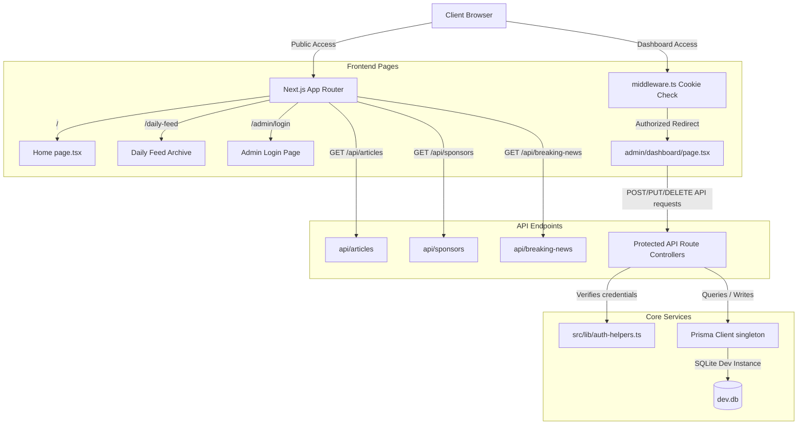

# 02 Project Architecture

This document describes the architectural layout of the Forex Weekly CMS platform, including folder routing schemas, auth middleware configurations, and technical module dependencies.

---

## 1. Folder Structure Overview

```text
forex-weekly/
├── prisma/
│   ├── dev.db               # SQLite database file
│   └── schema.prisma        # Prisma DB models config
├── public/
│   ├── uploads/             # Local directory for uploaded media
│   ├── logo.jpg             # Primary branding logo
│   └── backend_inventory.html # Printable inventory document
├── src/
│   ├── app/
│   │   ├── admin/           # Admin pages (login, dashboard, create)
│   │   ├── api/             # API routes (auth, articles, sponsors, contact)
│   │   ├── layout.tsx       # Root layout configuration
│   │   └── page.tsx         # Homepage view
│   ├── components/
│   │   ├── layout/          # Layout blocks (Header, Navbar, Footer, TopBar)
│   │   ├── ui/              # Reusable elements (ArticleCard, AdBanner)
│   │   └── widgets/         # Widgets (ForexRates, EconomicCalendar, TickerBar)
│   ├── data/
│   │   └── mockData.ts      # Seeding backup and default fallback structures
│   ├── lib/
│   │   ├── auth.ts          # jose JWT sign/verify logic
│   │   ├── auth-helpers.ts  # Centralized session & RBAC stubs
│   │   └── db.ts            # Prisma Client singleton manager
│   └── middleware.ts        # Next.js route blocker
```

---

## 2. Technical Architecture & Routing Map



---

## 3. Core Subsystems

### Middleware & Authentication Flow
- **Middleware Protection**: The system intercepts requests utilizing Next.js native `middleware.ts`. Any requests targeting `/admin/dashboard/*` must supply an `admin_token` cookie containing a valid signature.
- **JWT Helper**: Signed utilizing `jose` (using `HS256` hashing). The validation uses a server-defined `JWT_SECRET` key.

### Component Layout
- **Widgets System**: Real-time elements (like the TradingView Technical Analysis gauge, economic calendar, and ticker) run client-side, making requests to endpoints to hydrate content.
- **Header & Footer Branding**: Modular wrappers importing brand logos and layouts, pulling active ad configurations dynamically from `/api/sponsors` on load.
