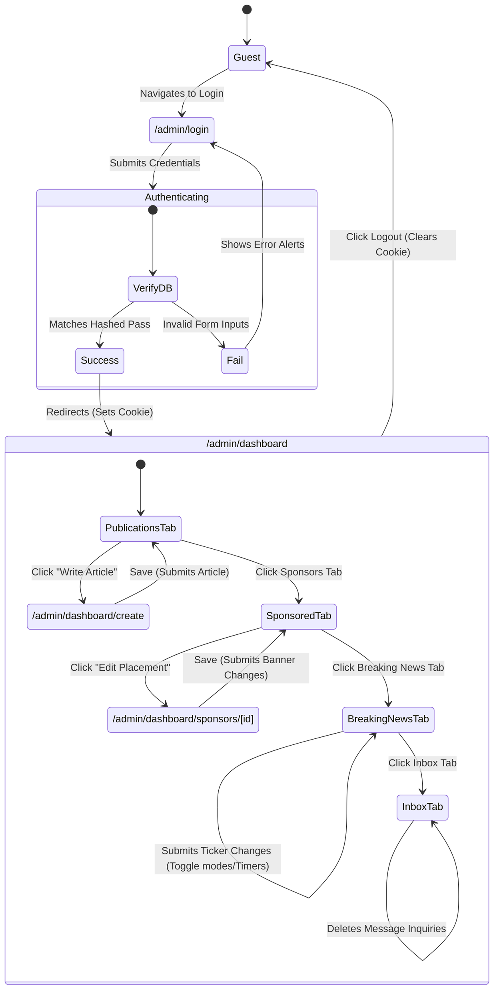

# 06 Navigation Map

This document maps out the backend page structures, navigation flows, and user workspace paths inside the Forex Weekly Admin dashboard.

---

## 1. Backend Page Routes

The dashboard is structured into 4 distinct admin layouts:

```text
/admin/login
  └── (Form entry validation)
        └── Redirect -> /admin/dashboard
                          ├── Tab: Publications (Default)
                          │     └── Click "Write Article" -> /admin/dashboard/create
                          ├── Tab: Sponsored Placements
                          │     └── Click "Edit" -> /admin/dashboard/sponsors/[id]
                          ├── Tab: Breaking News
                          │     └── (Manual Ticker list manager inputs)
                          └── Tab: Inbox Messages
                                └── (Inquiry logs database table view)
```

---

## 2. Navigation Flows & User Journeys



---

## 3. Sidebar / Tab Navigation Structure

The main dashboard (`src/app/admin/dashboard/page.tsx`) organizes operations using a top-level horizontal navigation bar rather than a vertical sidebar, styled to fit administrative panels:
* **Publications**: Displays a pageless list of all articles stored in the database. Features search/filter inputs and a prominent red `+ Write Article` CTA button that redirects to the standalone creation page.
* **Sponsored Placements**: Grid display listing current banners (Leaderboard, Sidebar Square, Inline Article Strip), showing dynamic preview thumbnails, link destinations, and CTA target urls.
* **Breaking News Ticker**: Radio toggles to configure site-wide alert displays. Renders multiple inline headline input fields (up to 11 slots) with integrated dropdown expiry limits and line deletions.
* **Inbox Messages**: Standard message grid showing incoming contact inquiries (Timestamp, Sender Details, Subject, Message Preview) with simple deletion buttons to resolve customer items.
* **Header Actions**: Features a top-right `Logout` button, which clears the session cookie and redirects the user back to the login screen.
