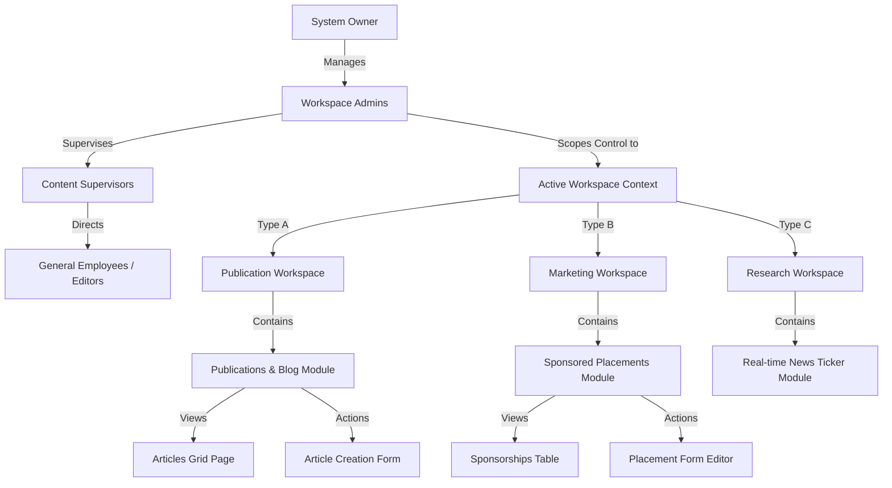

# 02 Information Architecture

This document maps the hierarchy, reporting relationships, and data scoping of the Enterprise CMS backend.

---

## 1. System Scoping & Reporting Hierarchy

The diagram below details the organizational topology of the platform:

---

## 2. Data Partitioning Flow

1. **User Identity Verification**: Users log in, and their JWT claims are verified to resolve their User ID, Role, and authorized Workspaces list.
2. **Context Selection**: The system sets the active Workspace based on the user's choice.
3. **Database Scoping**: Database queries are automatically filtered using the selected workspace parameter (e.g. `prisma.article.findMany({ where: { workspaceId } })`), ensuring complete data isolation between tenants.
