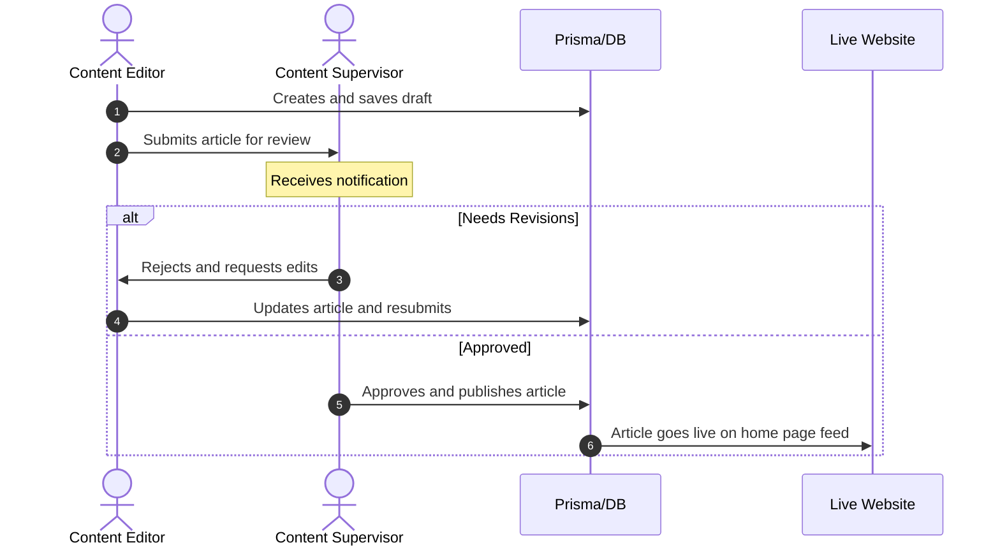
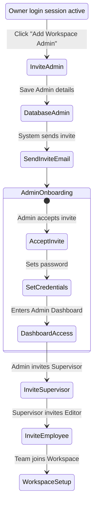

# 10 User Journeys

This document details the step-by-step user journeys and workflows for key administrative operations in the Enterprise CMS.

---

## 1. Editorial Workflow: Writing & Publishing

This diagram shows the path of a publication draft from creation to release:

---

## 2. Admin Onboarding Workflow

The diagram below details the hierarchy setup path during system setup:

