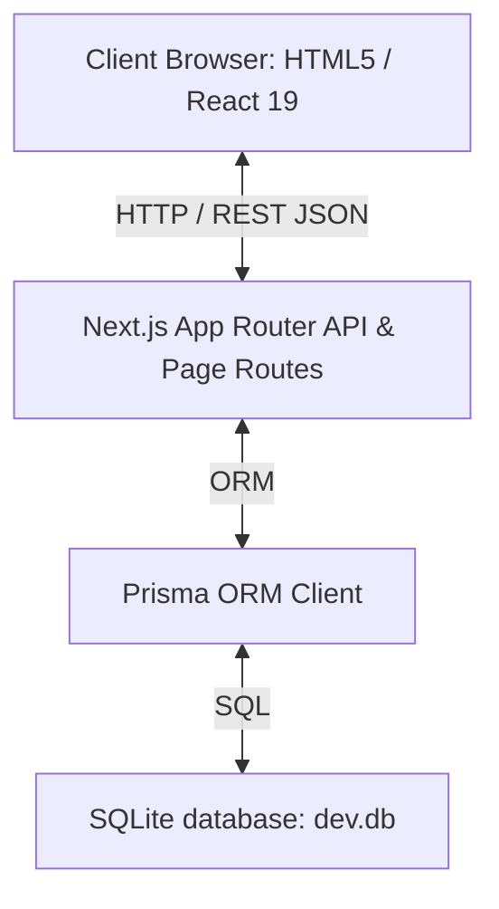

# Final System Architecture

The Forex Weekly CMS is built using a modern, scalable web stack following modular architectural design principles:

## 1. Frontend Layer
- **Core Technology**: React 19, Next.js 16 (App Router with Turbopack).
- **Styling**: TailwindCSS 4 (utility-first system styling).
- **State Management**: React State Hooks (`useState`, `useEffect`, `useContext`) combined with debounced network fetching.
- **Access Control**: Dynamic menu rendering based on cookie session roles.

## 2. API & Routing Layer
- **Path Isolation**: The admin backend layout is completely decoupled from public site layouts by inspecting incoming path headers at layout compile-time.
- **REST Endpoints**: Secure JSON endpoints for user actions, editorial operations, ticker messages, alerts, and private chats.

## 3. Database Layer
- **ORM**: Prisma ORM with relational mapping configurations.
- **Storage engine**: SQLite local database file (`prisma/dev.db`), easily swappable with enterprise engines (e.g. PostgreSQL, MySQL).
