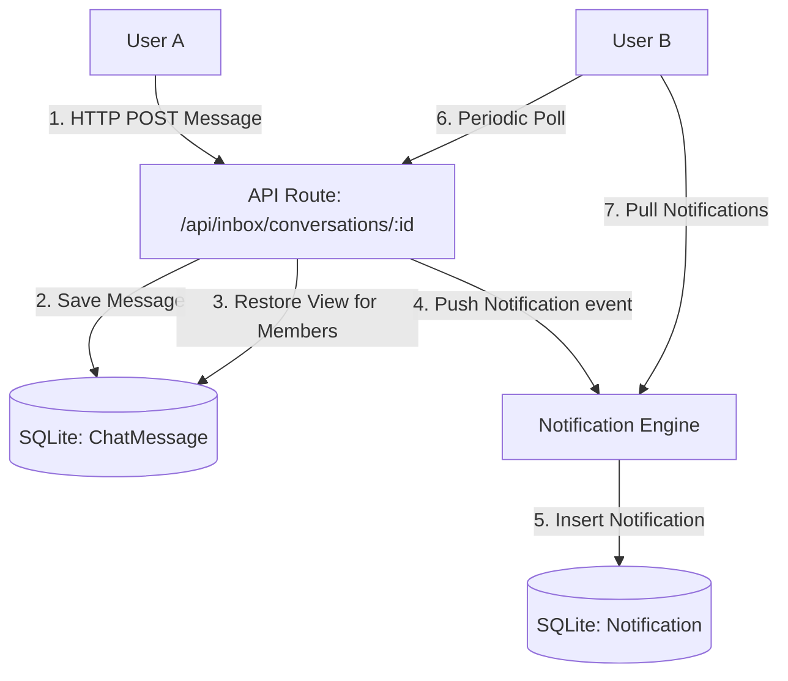

# Updated Architecture - Phase 9

## Conceptual Overview
The Inbox system acts as a work-focused platform hub for team members. It is not an active real-time socket-based chat system, but a database-driven, secure Inbox optimized for performance.

## Architectural Flow

## Universal Routing & Side Menu
To keep all modules distinct, the sidebar has been enhanced to group sub-elements:
- **Inbox**
  - **Direct Messages**: Private 1-to-1 conversation rooms between active team members.
  - **Groups**: Collaboration channels managed by administrative levels.
  - **Announcements**: Platform-wide notice board for broadcasts.
  - **Public Inquiries**: Legacy Contact Inbox preserving public visitor inquiries.
