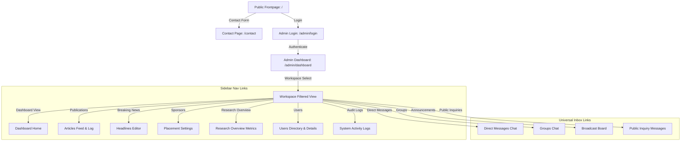

# Navigation Map, Pages, and Routes List

## 1. Navigation Map

## 2. List of All Pages
- **Public Frontend**:
  - `/` (Home Frontpage feed)
  - `/contact` (Public contact form page)
  - `/about` (Static company about page)
  - `/privacy` (Privacy policy information page)
  - `/terms` (Terms of service information page)
  - `/daily-feed`, `/weekly-updates`, `/forex`, `/global-events`, `/learn-forex` (Category landing listings pages)
  - `/[category]/[id]` (Individual article detail pages)
  - `/free-assessment` (Public landing assessment page)
- **Admin Backend Control Panel**:
  - `/admin/login` (Admin and employees login portal)
  - `/admin/dashboard` (Master Admin Dashboard workspace switcher & sub-tabs panels)
  - `/admin/dashboard/profile` (Logged-in user profile manager tab)
  - `/admin/dashboard/create` (Editorial new article composer workspace)
  - `/admin/dashboard/users/create` (Invite user configuration workspace)
  - `/admin/dashboard/users/[id]` (Detailed active user details view workspace)
  - `/admin/dashboard/sponsors/[id]` (Detailed sponsor settings workspace)

## 3. List of All Frontend App Routes
- `/`
- `/contact`
- `/about`
- `/privacy`
- `/terms`
- `/daily-feed`
- `/weekly-updates`
- `/forex`
- `/global-events`
- `/learn-forex`
- `/free-assessment`
- `/[category]/[id]`
- `/admin/login`
- `/admin/dashboard`
- `/admin/dashboard/profile`
- `/admin/dashboard/create`
- `/admin/dashboard/users/create`
- `/admin/dashboard/users/[id]`
- `/admin/dashboard/sponsors/[id]`
